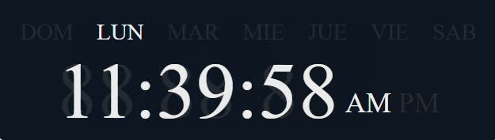

# Reloj digital

Este es un reloj digital creado con React y Styled components.

## Demo



También puede consultar la demostración en vivo del Reloj Digital. [Aqui](https://).


## Instalación

Clonar el repositorio.

```bash
  git clone <reponame>
```

Instalación de dependencias.

```bash
npm i or npm install
```

Iniciar servidor

```bash
npm run start
```

## Stack tecnológico

**Client:** React.js, useEffect, useState, styled components.


## Support

Si encuentra útil este proyecto o le gustaría apoyar mi trabajo, puede ⭐ este repositorio
